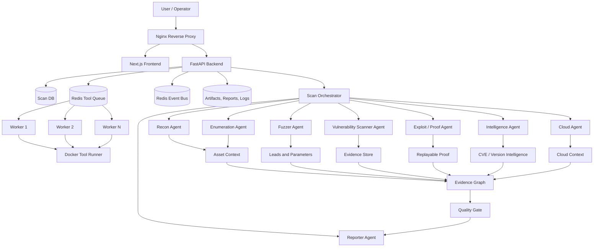
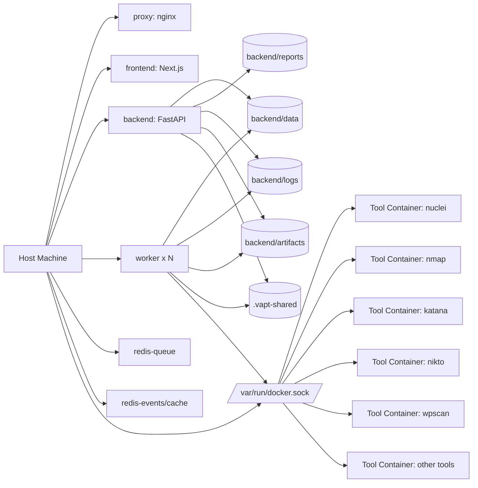
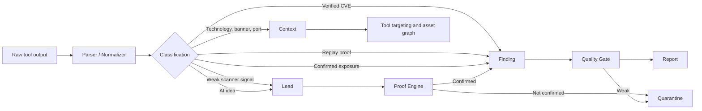
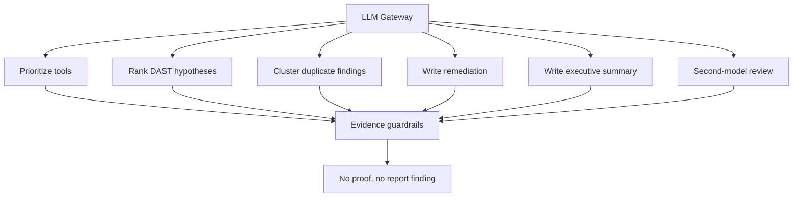
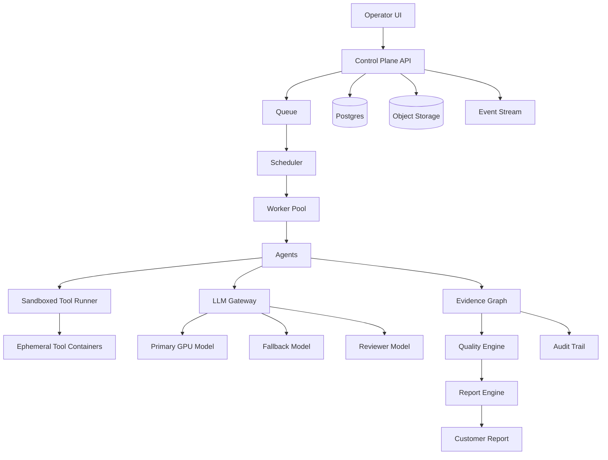

# Dockerized Multi-Agent VAPT Architecture

## Goal

Build a commercial VAPT platform that finds real vulnerabilities, minimizes false positives, preserves evidence, and produces audit-grade reports.

The product should not be a wrapper around many tools. The product should be an evidence system.

```text
Tools are replaceable.
Evidence is the product.
```

## High-Level System



## Docker Runtime



## Agent Responsibilities

| Agent | Main job | Output type |
|---|---|---|
| Recon Agent | Find subdomains, live URLs, historical URLs, crawled URLs, DNS, technology context | Asset context |
| Enumeration Agent | Ports, services, TLS, WAF, service banners | Service context |
| Vulnerability Scanner Agent | Run evidence-based scanners like nuclei, Nikto, CMS checks | Candidate findings |
| Fuzzer Agent | Hidden paths, parameters, API patterns, JS endpoints | Leads |
| Exploit / Proof Agent | Safely validate DAST hypotheses | Confirmed findings |
| Intelligence Agent | CVE, version, internet exposure enrichment | Verified or suspected intelligence |
| Cloud Agent | Cloud provider, bucket, public exposure checks | Cloud context / findings |
| Reporter Agent | Quality gate, dual review, remediation, report generation | Customer report |

## Evidence Lifecycle



## LLM Placement

LLM is a reasoning layer around evidence. It must not directly create customer-facing vulnerabilities.



Current configured chain:

1. Primary: `openai_compat` using local vLLM Qwen.
2. Fallback: `ollama` qwen through ngrok.
3. Fallback: `http_basic_chat` llama3.2 through Basic Auth endpoint.

## Enterprise Target State


