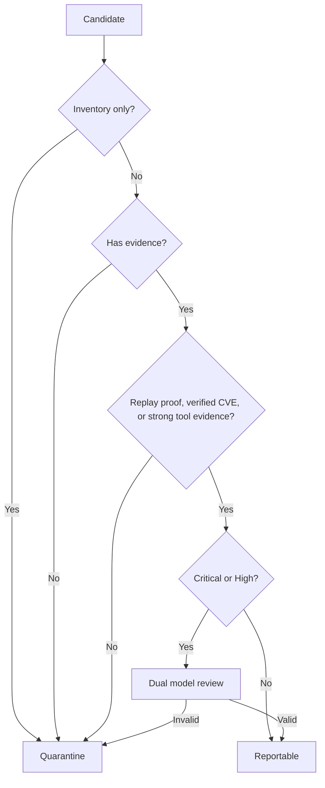

# Finding Quality Policy

## Purpose

Reduce false positives and make the report commercially credible.

The product must separate:

```text
Context
Lead
Suspected finding
Confirmed finding
Quarantined finding
```

## Classification Rules

| Item | Example | Customer report? |
|---|---|---|
| Technology context | Nginx detected | No |
| Service context | Port 443 open | No |
| Recon summary | Scan completed | No |
| AI lead | Endpoint may be IDOR | No |
| Weak tool signal | Potential backup file | No, unless replay proves it |
| Suspected finding | Scanner signal with partial evidence | No by default |
| Confirmed finding | Replay proof or verified CVE | Yes |
| Critical/high finding | Confirmed plus second-model review | Yes if review passes |

## Reportable Finding Requirements

A finding can be customer-facing when at least one of these exists:

```text
Replayable HTTP request/response proof
Confirmed DAST validator proof
Verified CVE with version evidence
Confirmed sensitive exposure
Confirmed unsafe configuration
Confirmed vulnerable service behavior
```

## Non-Reportable Examples

These must not appear as vulnerabilities:

```text
Nginx detected on 4 hosts
React detected
Cloudflare detected
Port 443 open
Server header exists
Recon completed
Technology may have known vulnerabilities
AI suggested this might be risky
```

## Current Quality Gate



## Evidence Score Intention

Evidence score should reward:

```text
Confirmed status
High confidence
Request proof
Response proof
CVE IDs
NVD validation
CWE mapping
Tool evidence
Replay proof
```

Evidence score should penalize:

```text
AI-only claims
Low confidence
No evidence
No request/response proof for high severity
Inventory-only records
False positive status
Short or generic descriptions
```

## AI Policy

AI can:

```text
Prioritize tools
Rank DAST hypotheses
Cluster duplicate findings
Write remediation
Write executive summary
Review critical/high findings
Generate leads for validation
```

AI cannot:

```text
Create a customer-facing vulnerability without evidence
Invent CVEs
Invent exploitability
Invent ports, paths, buckets, or versions
Promote weak scanner output to confirmed
```

## Commercial Report Policy

The final report should contain:

```text
Confirmed vulnerabilities
Validated exposures
Verified misconfigurations
Replayable proof
Clear remediation
Evidence chain
```

The final report should not contain:

```text
Inventory
Tool noise
AI guesses
Unvalidated leads
Generic technology warnings
```
