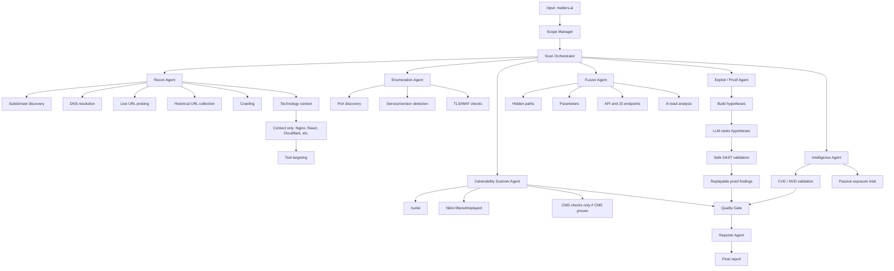
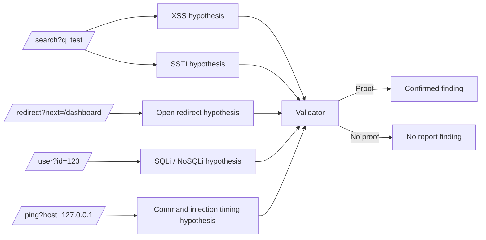

# Example Target Flow: matters.ai

This is the expected behavior when an operator enters:

```text
matters.ai
```

## End-to-End Flow



## Step 1: Scope

The scanner creates an authorized scope for `matters.ai`.

Expected in-scope examples:

```text
matters.ai
app.matters.ai
demo.matters.ai
payu.matters.ai
groww.matters.ai
https://app.matters.ai/*
```

Out-of-scope examples:

```text
third-party payment provider domains
analytics domains
CDN domains not explicitly allowed
external links discovered in JS
```

## Step 2: Recon

Recon should collect:

```text
Subdomains
DNS records
Live URLs
Historical URLs
Crawled URLs
Technology context
```

Example context:

```text
app.matters.ai -> HTTPS live, Nginx, React
demo.matters.ai -> HTTPS live, Nginx
payu.matters.ai -> HTTPS live
```

This must not become a finding:

```text
Nginx detected on app.matters.ai
```

It is stored only as context for targeting.

## Step 3: Enumeration

Enumeration should answer:

```text
Which services are exposed?
Which ports are open?
Which TLS/cert configuration exists?
Which service versions are actually visible?
```

Example:

```text
app.matters.ai:443 https
demo.matters.ai:443 https
```

Open `443` is not a vulnerability. It is asset context.

## Step 4: Vulnerability Scanning

Nuclei and similar scanners run against live targets.

Good candidate:

```text
/.git/config exposed
```

Weak candidate:

```text
/ai.pem potentially interesting file
```

Weak candidates must be replayed before they become findings.

## Step 5: Fuzzing and API Discovery

Fuzzing discovers paths and parameters such as:

```text
https://app.matters.ai/search?q=test
https://app.matters.ai/redirect?next=/dashboard
https://api.matters.ai/user?id=123
https://demo.matters.ai/debug
```

AI may generate leads:

```text
/user?id=123 may need IDOR validation.
/redirect?next= may need open redirect validation.
/search?q= may need XSS/SSTI validation.
```

These are leads, not findings.

## Step 6: DAST Proof

The proof engine creates hypotheses and validates them safely.



## Step 7: Intelligence

CVE findings require strong version evidence.

Bad:

```text
Nginx detected, may have vulnerabilities.
```

Good:

```text
Product and version are detected, CVE is verified, and the affected version range matches.
```

## Step 8: Report

Report should include:

```text
Confirmed vulnerabilities
Verified misconfigurations
Replayable DAST proof
Verified CVE/version issues
Exposed sensitive files confirmed by HTTP replay
```

Report should not include:

```text
Nginx detected
React detected
Cloudflare detected
Recon completed
Port 443 open
AI thinks endpoint may be risky
```

Those belong in attack surface or leads, not findings.
