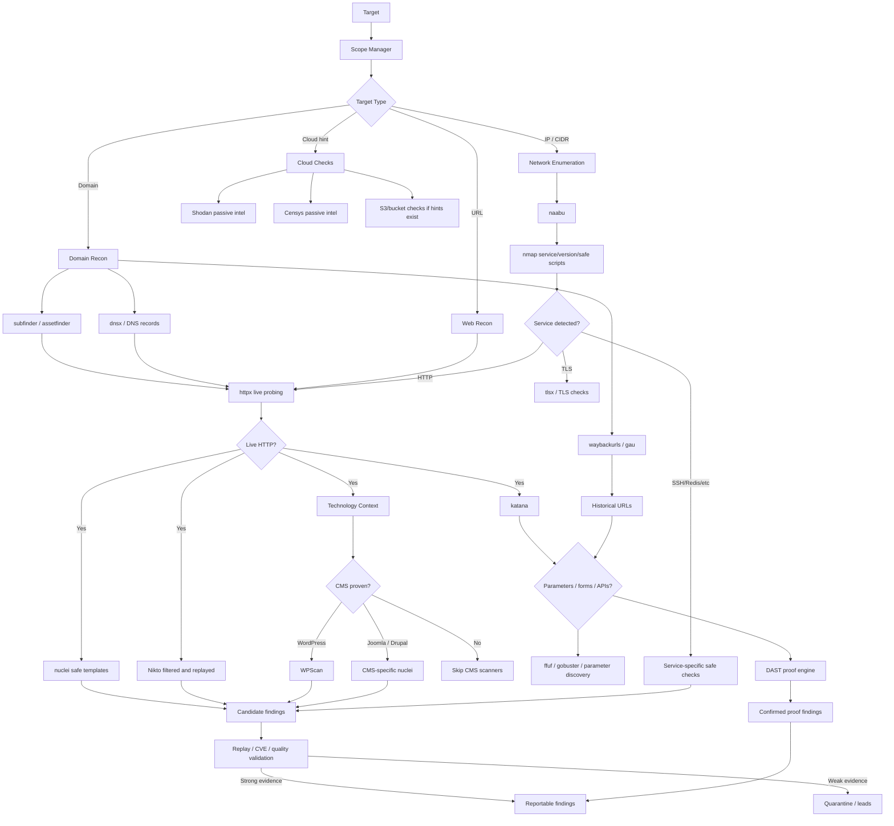

# Tool Selection Graph

This document describes when tools should run. The platform should select tools based on evidence, not run every tool blindly.

## Full Tool Decision Graph



## Tool Categories

| Category | Tools | Expected output |
|---|---|---|
| Subdomain discovery | subfinder, assetfinder | Subdomains |
| DNS resolution | dnsx | Resolved hosts, DNS records |
| HTTP probing | httpx, httprobe | Live URLs, titles, status codes, technologies |
| Crawling | katana, hakrawler | URLs, JS files, APIs, parameters |
| URL archives | waybackurls, gau | Historical URLs and parameters |
| Port scanning | naabu, nmap | Open ports, services, versions |
| Vulnerability templates | nuclei | Template evidence, CVEs, exposures |
| Web checks | Nikto | Candidate misconfigurations, replay required |
| CMS checks | WPScan and CMS nuclei | CMS-specific candidate findings |
| Content discovery | ffuf, gobuster | Hidden paths and endpoints |
| DAST proof | internal validators | Confirmed replayable vulnerabilities |
| Passive intel | Shodan, Censys, NVD | Exposure and CVE intelligence |

## Important Guardrails

```text
Technology detected != vulnerability.
Port open != vulnerability.
AI suspicion != vulnerability.
Scanner weak signal != final report finding.
Replay proof or verified CVE or confirmed misconfiguration = reportable.
```

## Current DAST Validators

| Validator | Example signal | Report condition |
|---|---|---|
| XSS reflection | `q` parameter reflects payload | Payload marker returned unencoded |
| SSTI arithmetic | `{{7*7}}` | Response evaluates to `49` not in baseline |
| SQLi error proof | quote payload | SQL error appears only after payload |
| NoSQLi error proof | Mongo operator payload | NoSQL error appears only after payload |
| LFI/path traversal | file/path parameter | Known file marker returned |
| Open redirect | redirect parameter | `Location` points to external proof URL |
| Command injection timing | host/cmd parameter | Stable timing delta from sleep probe |
